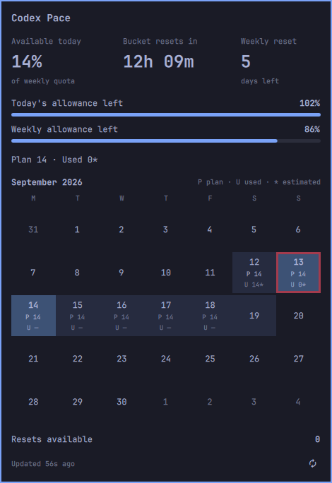

# Codex Pace

**Make your Codex subscription last through the week.**

Codex Pace is an Omarchy bar plugin that helps you keep a steady, even pace of AI usage. See how much of your weekly quota you can spend today without eating into the days ahead.

It divides your quota week into seven equal, 24-hour planning buckets, each with one-seventh of the quota (displayed as 14%). Spend less and the surplus is available the next day. Spend more and the next day's allowance shrinks. Any unused quota expires at the weekly reset.

## Reading the display

- **Available today** is the share of your weekly quota you can still spend in the current bucket while keeping the rest of the week on pace.
- **Bucket resets in** counts down to the next daily planning bucket. Buckets follow your weekly reset time, so they usually start and end partway through a calendar day.
- **Weekly reset** shows the full days left after the current bucket. Combine it with the bucket countdown for the total time remaining.
- **Today's allowance left** compares what's available with the daily plan. It can exceed 100% when more than a standard day's allowance remains. **Weekly allowance left** shows the balance reported by Codex.
- **P / U** means Plan / Used, in weekly quota percentage points. An asterisk marks an estimate, not measured daily consumption. Hover for details. Numbers omit fractional parts.

The calendar shades the dates covered by your quota week. Seven 24-hour buckets usually touch **eight calendar dates**, because the week starts and ends partway through a day. The stronger blue fill marks the current bucket; the red outline marks today's date. Each bucket's P/U figures appear once, on its starting date.

**Resets available** shows your reported reset-credit count. Readings refresh every five minutes; use the circular-arrow button to refresh now.

## Get started

You'll need Omarchy with native plugin support and a Codex CLI signed in with your subscription. Follow the [installation instructions](agents.md#install).

Codex Pace helps you plan; it does not enforce spending limits. Daily usage can be estimated, so use the weekly balance as your reference.
